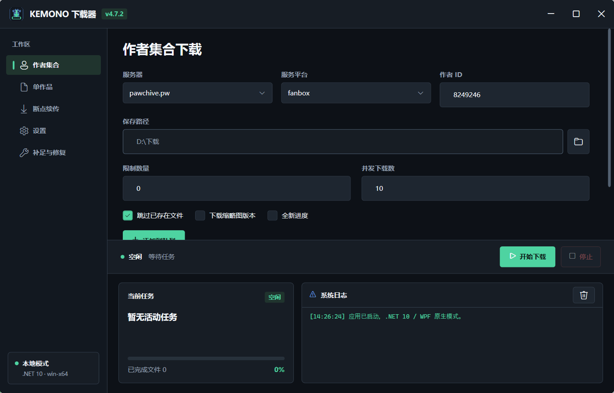
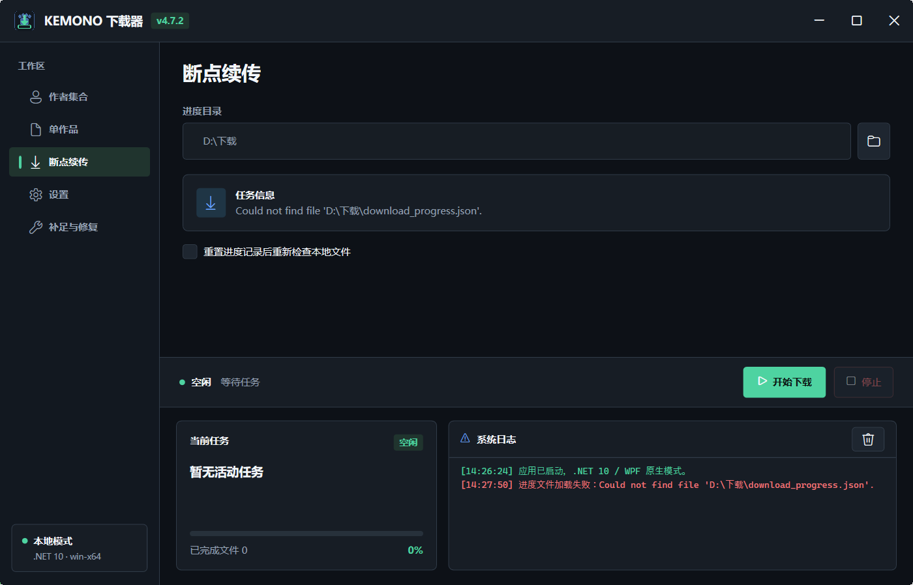
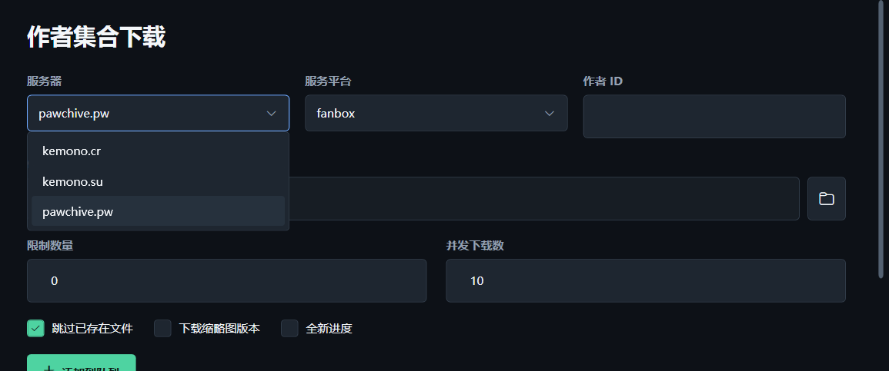
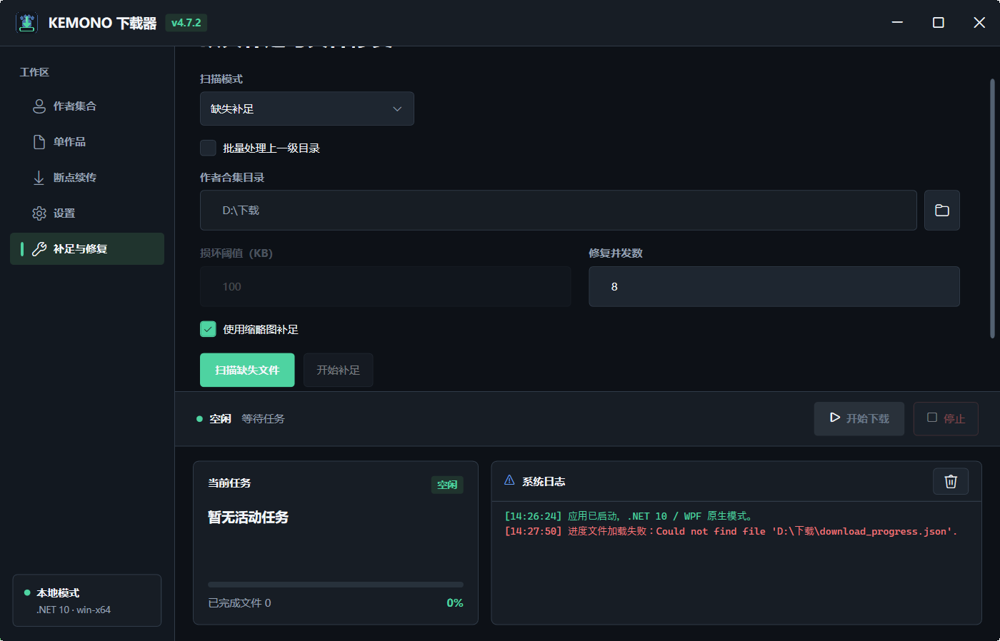

# Kemono 下载器 v3.0.0

**简体中文** | [English](README.en.md)

基于 .NET 10 和原生 WPF 的 Windows 桌面下载器。项目已从 Electron/Node.js 完整迁移到 C#，不再需要 Node 运行时。

详细更新内容请参阅 [3.0.0 更新公告](UPDATE_NOTICE_3.0.0.md)。



## 功能

- 作者集合下载，支持 Fanbox、Patreon、Fantia、SubscribeStar、Gumroad 和 Discord
- 作者下载任务队列，可在当前任务运行时继续按服务器和作者 ID 排队，并显示解析后的作者名称
- 单作品链接下载
- 分页抓取、数量限制和原始 JSON 数据保存
- 可配置并发、作品入队间隔和最大下载尝试次数（默认 3 次）
- 跨作品滚动下载池，空闲槽位立即补入新附件
- 自适应附件超时：响应头、连续无数据、持续低速和动态总时长分别判定
- 跨重试与软件重启的 HTTP Range 断点续传，保留 `.part` 和 `.part.meta.json`

  

- HTTP 429 自适应降并发与恢复
- HTTP、HTTPS、SOCKS5 代理及代理认证
- 服务器域名切换，内置 `kemono.cr`、`kemono.su`、`pawchive.pw` 并支持自定义域名

  

- 兼容 Kemono/Pawchive 作者资料字段，旧 `user_<ID>` 目录可自动迁移为作者名称
- 缩略图下载模式
- 新任务自动增量下载和任务进度续传
- 断点续传始终写回所选作者目录，不受其他页面保存路径影响
- Content-Length 校验、错误响应类型识别和原子写入
- 损坏文件扫描与重新下载
- 缺失附件扫描与补足，可选使用缩略图替代无法获取的原图

  

- 缺失扫描结果按作品分组查看，可展开核对具体顺序文件和原始附件名
- 批量扫描作者合集上一级目录，并逐作者执行缺失补足或损坏修复
- 实时进度、结构化日志和安全停止
- 窗口位置与大小记忆
- 自动记忆服务器、保存目录和各下载页面的最近配置

## 系统要求

- Windows 10 或更高版本
- 开发环境：.NET SDK 10.0.400 或兼容的 .NET 10 SDK

发布的自包含版本不要求用户另外安装 .NET Desktop Runtime。

## 开发

```powershell
dotnet restore KemonoDownloader.slnx
dotnet build KemonoDownloader.slnx
dotnet test tests\KemonoDownloader.Tests\KemonoDownloader.Tests.csproj
dotnet run --project src\KemonoDownloader.Wpf\KemonoDownloader.Wpf.csproj
```

## 发布

```powershell
dotnet publish src\KemonoDownloader.Wpf\KemonoDownloader.Wpf.csproj `
  -c Release `
  -p:PublishProfile=win-x64
```

输出位于 `artifacts/publish/win-x64/`。该配置使用 Windows x64、自包含和单文件发布。

## 下载目录

```text
<保存路径>/<作者名>/
├── download_progress.json
├── json/
│   ├── 1.json
│   └── post_<postId>.json
└── src/
    └── <发布日期> <作品标题>/
        ├── 1.jpg
        └── 2.png
```

进度文件使用 `schema_version: 2`。Electron 旧版本生成的进度文件不会被覆盖，应用会提示其格式不受支持；请为 WPF 版本创建新任务。

## 项目结构

```text
src/
├── KemonoDownloader.Core/            # 模型、规则和公共接口
├── KemonoDownloader.Infrastructure/  # HTTP、代理、下载、进度、设置和修复
└── KemonoDownloader.Wpf/             # WPF 界面和 MVVM
tests/
└── KemonoDownloader.Tests/           # xUnit 单元和集成测试
```

## 设置文件

- `%AppData%/KemonoDownloader/settings.json`
- `%AppData%/KemonoDownloader/window-state.json`

代理密码通过 Windows DPAPI 按当前用户加密保存。

附件下载默认等待响应头 30 秒；图片和普通附件连续 60 秒无数据、视频连续 120 秒无数据时结束当前尝试。传输中的文件不再受固定总时长限制，持续低速与动态硬上限可在设置页的“高级下载超时”中调整。

## 免责声明

本项目仅供学习和研究使用。使用者应遵守目标网站的服务条款、当地法律及内容版权要求，并自行承担使用风险。

## License

[MIT](LICENSE)
